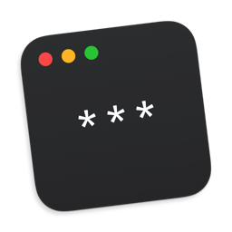
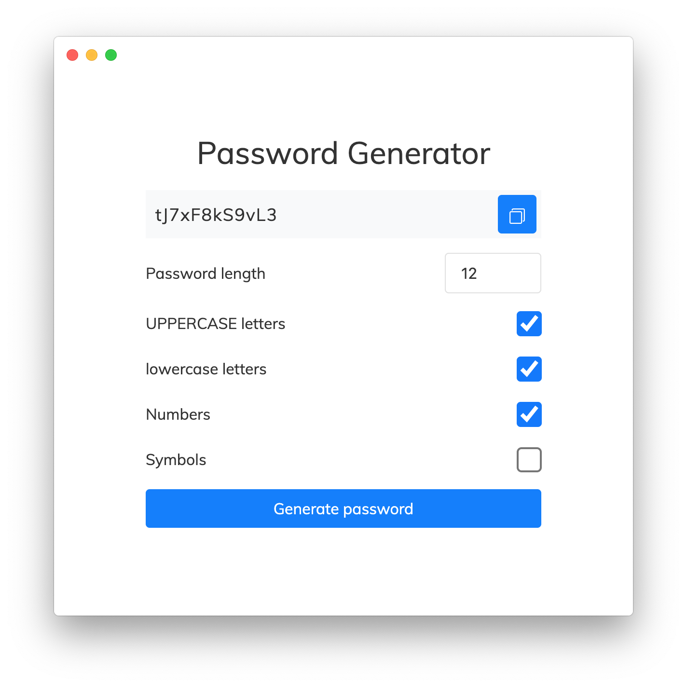

# Password generator



### Simple password generator

- define password length (8-20 symbols, 12 is default)
- include UPPERCASE letters
- include lowercase letters
- include digits
- include special symbols `!@#$%^&*(){}[]=<>/,.`
- **Auto-copies password to clipboard once generated 😎**



### Download

Release section: [Link](https://github.com/borisevstratov/password-generator/releases)

<hr>

Build command:

```
npm install
cd app
npm run build-mac
```

Build folder:  
`/builds/`
